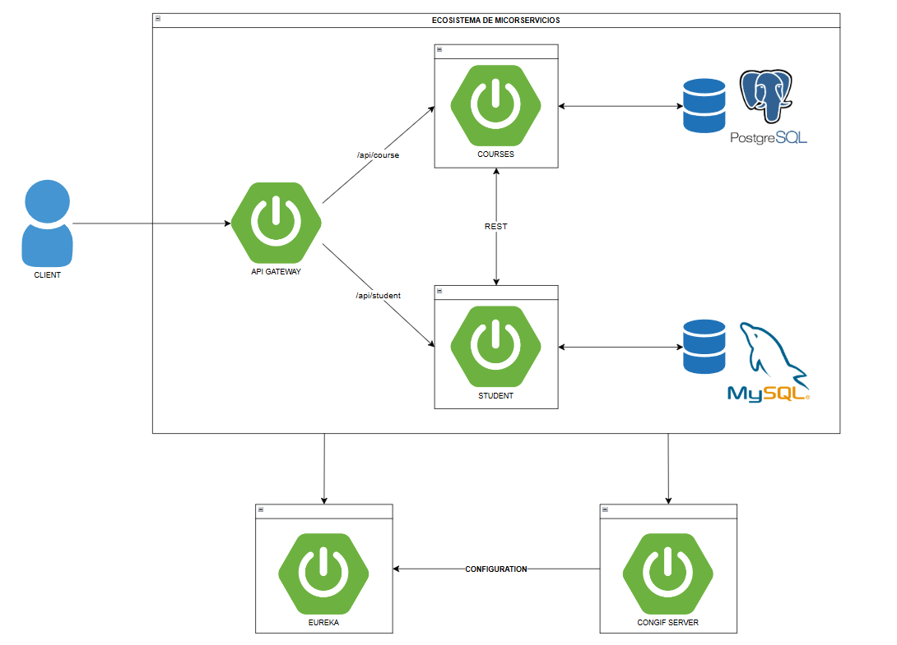

# Spring Boot Microservices

Este proyecto es un ejercicio práctico de es un sistema modular basado en microservicios con **Spring Boot 3.5**, **Spring Cloud 2025.0.0**, y Java 21. Incluye componentes como Eureka, Config Server, Gateway, y servicios de negocio (`student`, `course`) conectados mediante arquitectura distribuida.

---

##  Estructura del Proyecto

```
springMicroservices/
│
├── pom.xml -> Padre - Módulo POM principal
├── microservice-config/ -> Config Server (Spring Cloud Config)
├── microservice-eureka/ -> Eureka Server (Descubrimiento de servicios)
├── microservice-gateway/ -> Spring Cloud Gateway (WebFlux)
├── microservice-student/ -> Microservicio Student
└── microservice-course/ -> Microservicio Course
```
---
##  Arquitectura del sistema



### - Config Server (`microservice-config`)
Servidor de configuración centralizada para todos los microservicios.

### - Eureka Server (`microservice-eureka`)
Servidor de descubrimiento de servicios. Los microservicios cliente se registran aquí automáticamente.

### - Gateway (`microservice-gateway`)
API Gateway reactivo usando **WebFlux**. Encaminamiento dinámico mediante configuración desde el Config Server. Usa `@EnableDiscoveryClient`.

### - Student Service (`microservice-student`)
Microservicio de estudiantes. Persistencia con JPA y MySQL. Cliente de Eureka y cliente de configuración.

### - Course Service (`microservice-course`)
Microservicio de cursos con PostgreSQL. Cliente de Eureka, Config Server y usa **OpenFeign** para comunicación entre microservicios.


##  Tecnologías usadas

- Java 21
- Spring Boot 3.5.3
- Spring Cloud 2025.0.0
- Spring Cloud Config Server
- Spring Cloud Eureka**
- Spring Cloud Gateway (WebFlux)
- Spring Data JPA
- Feign (en `course`)
- Actuator
- MySQL y PostgreSQL

---

## Ejecutar los microservicios (en orden recomendado)
- microservice-config
- microservice-eureka
- microservice-student
- microservice-course
- microservice-gateway

---

```bash
git clone https://github.com/MAGZ014/Spring-Microservices.git
cd springMicroservices
```

---

## Créditos

Este proyecto está basado en el ejercicio mostrado en el canal [Un Programador Nace](https://youtube.com/@unprogramadornace).  
Gracias al creador por compartir contenido educativo de calidad.
Todo el crédito por la lógica original pertenece a su autor.
